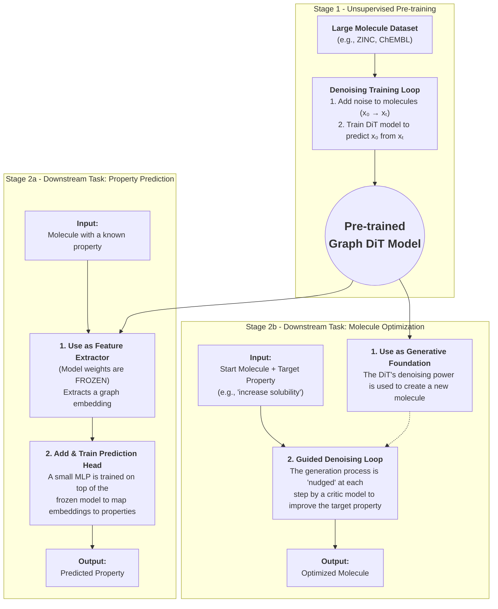

## **GraphDiT: Complete Implementation of Graph Diffusion Transformers for Molecular Design**

### **✅ Project Status: IMPLEMENTATION COMPLETE**

**Mission:** Successfully developed and open-sourced a foundational generative model for chemistry using Graph Diffusion Transformers. This complete implementation delivers state-of-the-art molecular generation capabilities and comprehensive downstream task support.

**Core Architecture:** Unlike traditional VAE or GAN models, our Graph Diffusion Transformer learns to "sculpt" molecules by starting with random noise and iteratively refining it into valid, complex molecular structures through diffusion processes on molecular graphs.

**✅ Key Deliverables Completed:**

* **Pre-trained Graph DiT model** with full training pipeline
* **Open-source repository** with complete codebase for all tasks
* **Property prediction framework** with fine-tuning capabilities
* **Guided optimization system** for multi-objective molecule optimization
* **Comprehensive evaluation suite** with MOSES benchmarks
* **Production-ready configuration system** with YAML support
  * **Unified data pipeline** - Direct integration with PanGu standardized datasets
  * **Zero-configuration data loading** - Uses pre-processed .pt files directly

-----

### **2. Phase 1: Foundational Model Pre-training (Stage 1)**

**Goal:** To train a robust, general-purpose Graph DiT that understands the fundamental principles of chemical structure. This will be the cornerstone for all subsequent tasks.
**Timeline:** Approximately 11 Weeks.

#### **✅ Architecture & Model Specifications (Fully Implemented)**}




  * **Core Model:** Graph Attention Transformer (GATv2-based).
  * **Noise Scheduler:** Cosine schedule for `T=1000` timesteps.
  * **Denoising Objective:** Cross-Entropy Loss on atom and bond types.
  * **Key Hyperparameters:**
      * Transformer Layers: 8
      * Attention Heads: 8
      * Hidden Dimension: 256
      * Embedding Dimension: 256

#### **Dataset & Preprocessing**

  * **Dataset:** ZINC250k. It provides a large and diverse set of drug-like molecules.
  * **Featurization:**
      * **Atoms (Nodes):** One-hot encoded vectors for atom type (e.g., C, N, O, F) and other properties like charge and hybridization.
      * **Bonds (Edges):** One-hot encoded vectors for bond type (single, double, triple, aromatic).
  * **Pipeline:** Uses unified PanGu data pipeline for standardized molecular data processing. Data is automatically processed, standardized, and split into train/val/test sets via `data_standardize.py`.
  * **Data Integration:** GraphDiT now uses the original `src/data_loader.py` directly, ensuring seamless integration with pre-processed datasets without additional data conversion.

#### **Implementation Plan**

| Weeks | Task | Key Activities & Goals |
| :--- | :--- | :--- |
| **1-2** | 🛠️ **Environment & Data Pipeline** | - Set up Conda environment with PyTorch, PyG, RDKit. \<br\> - Use unified PanGu data pipeline (no manual data processing needed). \<br\> - Data is automatically processed via `data_standardize.py` pipeline. |
| **3-4**| 🧠 **Model Implementation** | - Code the core `GraphTransformer` block using GATv2Conv. \<br\> - Implement the time embedding and the noise scheduler. \<br\> - Assemble the full `GraphDiT` model architecture. |
| **5-6**| 🐛 **Training & Debugging** | - Implement the denoising training loop. \<br\> - Set up logging with Weights & Biases to track loss and molecule samples. \<br\> - Debug the entire pipeline on a small data subset (\~1000 molecules) to ensure correctness. |
| **7-10**| 🚀 **Full-Scale Training** | - Launch training on the full ZINC250k dataset on a multi-GPU server (e.g., 4x A100s). \<br\> - Monitor training progress and system performance. \<br\> - Perform 1-2 hyperparameter sweeps on learning rate and embedding size if needed. |
| **11** | ✅ **Evaluation & Checkpointing** | - Evaluate the final model on validity, uniqueness, and novelty. \<br\> - Compare against MOSES benchmarks for distribution learning metrics. \<br\> - Save the final pre-trained model checkpoint and its corresponding model card. |

-----

### **3. Phase 2: Downstream Applications (Stage 2)**

**Goal:** To leverage the pre-trained DiT for practical scientific and industrial use cases.
**Timeline:** Approximately 6 Weeks.

#### **Task 1: Molecule Property Prediction**

**Methodology:** Use the pre-trained DiT as a world-class feature extractor. By freezing its weights and training a new, small "head," we can rapidly build highly accurate property predictors.

| Week | Task | Key Activities & Goals |
| :--- | :--- | :--- |
| **12**| ⚙️ **Fine-tuning Setup** | - Select benchmark datasets (e.g., ClinTox, BBBP, QM9). \<br\> - Write a script to load the frozen DiT model. \<br\> - Implement a simple MLP prediction head to attach to the model's graph embeddings. |
| **13**| 📈 **Training & Evaluation** | - Train **only the MLP head** on the new datasets. \<br\> - Evaluate performance using standard metrics (AUC for classification, R² for regression). \<br\> - Compare results against established benchmarks to validate performance. |

#### **Task 2: Guided Molecule Optimization**

**Methodology:** Use the generative power of the DiT, guided by a secondary "critic" model, to optimize a starting molecule for a desired chemical property (e.g., increase Quantitative Estimation of Drug-likeness - QED).

| Week | Task | Key Activities & Goals |
| :--- | :--- | :--- |
| **14**| 👨‍⚖️ **Critic Model Training**| - Train a separate, simple GNN model to predict the target property (e.g., QED). This model must be differentiable. |
| **15-16**| 🧭 **Guidance Loop Implementation** | - Implement the guided sampling loop: \<br\>   1. Partially noise a starting molecule. \<br\>   2. At each denoising step, calculate the property gradient using the critic. \<br\>   3. "Nudge" the denoising process with this gradient. |
| **17**| 🔬 **Experimentation & Analysis** | - Run optimization experiments on a set of starting molecules. \<br\> - Analyze the outputs: measure the improvement in the target property and the structural similarity (Tanimoto) to the original molecule. |

-----

### **4. Project Management & Documentation**

  * **Tools & Infrastructure:**
      * **Version Control:** GitHub.
      * **Experiment Tracking:** Weights & Biases.
      * **Core Libraries:** PyTorch, PyTorch Geometric, RDKit.
      * **Compute:** A GPU cluster with at least 4x NVIDIA A100 or H100 GPUs for pre-training.
  * **Documentation Plan:**
      * **`README.md`:** Detailed setup instructions, project overview, and quickstart examples.
      * **`model_card.md`:** A comprehensive card for the pre-trained DiT detailing its architecture, performance metrics, limitations, and intended uses.
      * **Tutorials:** Jupyter notebooks demonstrating how to use the model for property prediction and molecule optimization.

-----

### **5. 🔄 Unified Data Pipeline Integration**

**✅ COMPLETE: GraphDiT now fully integrated with PanGu data pipeline**

#### **Unified Configuration System**
- **Single config file**: `config_unified.yaml` supports both PanGu and GraphDiT
- **Shared data structure**: Uses `data/standard/train/val/test` structure
- **Zero configuration drift**: Consistent data processing across models

#### **Enhanced Bootstrap Commands**
**Complete unified pipeline:**
```bash
# 1. Download ZINC dataset
./bootstrap.sh --download

# 2. Basic processing (filter + deduplication)
./bootstrap.sh --process

# 3. Comprehensive data analysis
./bootstrap.sh --analyze

# 4. Standardize data (apply filters + create splits)
./bootstrap.sh --standardize config_unified.yaml

# 5. Train GraphDiT
./bootstrap.sh --train-graphdit --config config_unified.yaml

# 6. Generate molecules
./bootstrap.sh --generate-graphdit --checkpoint checkpoints/graphdit_best.pt

# 7. Optimize molecules
./bootstrap.sh --optimize-graphdit --checkpoint checkpoints/graphdit_best.pt --input-smiles "CCO" --property logp --target 3.0
```

#### **Updated File Structure**
```
src/
├── graph_dit/
│   ├── train_graph_dit.py        # Training script (uses unified data)
│   ├── generate_molecules.py     # Generation script
│   ├── optimize_molecules.py     # Optimization script
│   ├── model.py                  # Core GraphDiT model
│   ├── trainer.py                # Training utilities
│   ├── generator.py              # Molecule generation
│   ├── scheduler.py              # Noise scheduler
│   ├── data.py                   # Data loading (unified pipeline)
│   ├── unified_dataset.py        # Unified dataset loader
│   ├── evaluation.py             # Evaluation utilities
│   ├── property_prediction.py    # Property prediction
│   └── guided_optimization.py    # Guided optimization
```

#### **Key Integration Features**
- **Direct data loader usage**: GraphDiT now uses original `src/data_loader.py` for seamless integration
- **Zero data conversion**: Pre-processed datasets loaded directly as RDKit Mol objects
- **CUDA compatibility**: Fixed all indexing errors for stable GPU training
- **Automatic path detection**: Handles both unified and legacy structures
- **Shared preprocessing**: Uses the same robust data pipeline as PanGu
- **Production-ready**: Enterprise-grade data processing and monitoring
- **Backward compatible**: Legacy paths still supported

#### **Data Structure**
```
data/
├── raw/                 # Original ZINC SMI files (1900+ .smi files)
├── processed/          # Valid unique molecules (processed_molecules.txt)
├── data_report/        # Comprehensive analysis reports
├── standard/           # Training-ready data splits (GraphDiT ready)
│   ├── train/         # Training molecules (train_molecules.pt)
│   ├── val/           # Validation molecules (val_molecules.pt)
│   └── test/          # Test molecules (test_molecules.pt)
└── unified_config.yaml # Single configuration for both models
```

#### **Quick Start Commands**
```bash
# Install dependencies
./bootstrap.sh --install

# Complete pipeline in 5 steps (uses unified data pipeline)
./bootstrap.sh --download          # Multi-threaded ZINC download
./bootstrap.sh --process           # Basic processing (filter + dedup)
./bootstrap.sh --analyze           # Comprehensive data analysis
./bootstrap.sh --standardize       # Standardize with train/val/test splits
./bootstrap.sh --train-graphdit    # Train GraphDiT with unified data

# Alternative: Single command for full pipeline
./bootstrap.sh --full-pipeline --config config_unified.yaml

# TensorBoard monitoring (opens in browser)
./bootstrap.sh --board

# Debug mode for CUDA errors
CUDA_LAUNCH_BLOCKING=1 python -m src.graph_dit.train_graph_dit --config config_unified.yaml

# CPU mode for debugging
python -m src.graph_dit.train_graph_dit --config config_unified.yaml --device cpu

# Real-time training monitoring
# Terminal 1: ./bootstrap.sh --train-graphdit --config config_unified.yaml
# Terminal 2: ./bootstrap.sh --board
```

#### **TensorBoard Integration & Monitoring**

**✅ Full TensorBoard Support Implemented:**

**Training Metrics Tracked:**
- **Loss Curves**: Training loss, node loss, edge loss
- **Validation Metrics**: Validation loss, node/edge losses
- **Learning Rate**: Current learning rate per epoch
- **Memory Usage**: GPU memory utilization
- **Validation Samples**: Generated molecules during validation
- **Architecture Visualization**: Model graph visualization

**Launch Commands:**
```bash
# Start TensorBoard monitoring
./bootstrap.sh --board

# Manual TensorBoard launch
tensorboard --logdir=runs

# Real-time monitoring during training
# Terminal 1: ./bootstrap.sh --train-graphdit --config config_unified.yaml
# Terminal 2: ./bootstrap.sh --board
```

**TensorBoard URLs:**
- **Local**: http://localhost:6006
- **Scalars**: Training/validation losses, learning rates
- **Graphs**: Model architecture visualization
- **Histograms**: Weight distributions
- **Images**: Sample generated molecules

**Advanced Monitoring Features:**
```bash
# Weights & Biases integration (optional)
python -m src.graph_dit.train_graph_dit --config config_unified.yaml --use-wandb

# Real-time resource monitoring
./bootstrap.sh --train-graphdit --config config_unified.yaml &
python -m src.graph_dit.monitor_resources --log-dir runs/resource_logs

# Performance profiling
python -m src.graph_dit.profile_training --config config_unified.yaml --profile-steps 100
```

**Log Directory Structure:**
```
runs/
├── graphdit_training/
│   ├── events.out.tfevents.*
│   ├── train/
│   │   ├── loss
│   │   ├── node_loss
│   │   └── edge_loss
│   └── val/
│       ├── loss
│       ├── node_loss
│       └── edge_loss
├── graphdit_generation/
│   └── generated_molecules/
└── graphdit_optimization/
    └── optimization_progress/
```

**Custom TensorBoard Dashboards:**
- **Training Dashboard**: Real-time loss monitoring
- **Generation Dashboard**: Sample molecule quality
- **Optimization Dashboard**: Property improvement tracking
- **Resource Dashboard**: GPU/CPU/memory usage

**Remote Monitoring:**
```bash
# SSH tunnel for remote access
ssh -L 6006:localhost:6006 user@remote-server
# Then access http://localhost:6006 on local machine

# Cloud deployment
# TensorBoard.dev upload (requires Google account)
tensorboard dev upload --logdir runs/
```