## **Project Plan: Generative Molecular Design with Graph Diffusion Transformers**

### **1. Project Overview & Mission**

**Mission:** To develop and open-source a foundational generative model for chemistry using a Graph Diffusion Transformer. This project will deliver a state-of-the-art, pre-trained model capable of high-quality molecular generation (Stage 1) and provide a framework for adapting this model to critical downstream tasks, including property prediction and guided molecule optimization (Stage 2).

**Core Idea:** Unlike traditional VAE or GAN models, a Graph Diffusion Transformer learns to "sculpt" a molecule. It starts with random noise and iteratively refines it, step-by-step, into a valid, complex molecular structure. This method has proven to be exceptionally effective at learning the underlying rules of chemistry, resulting in higher-quality and more diverse molecular candidates.

**Key Deliverables:**

  * A pre-trained Graph DiT model checkpoint trained on a large-scale chemical dataset.
  * An open-source repository containing all code for pre-training, property prediction, and optimization.
  * A suite of fine-tuned models for benchmark property prediction tasks (e.g., toxicity, solubility).
  * Comprehensive documentation, including a model card, setup guides, and tutorials.

-----

### **2. Phase 1: Foundational Model Pre-training (Stage 1)**

**Goal:** To train a robust, general-purpose Graph DiT that understands the fundamental principles of chemical structure. This will be the cornerstone for all subsequent tasks.
**Timeline:** Approximately 11 Weeks.

#### **Architecture & Model Specifications**

```mermaid
graph TD
    %% Stage 1: Pre-training the model
    subgraph "Stage 1 - Unsupervised Pre-training"
        A["<b>Large Molecule Dataset</b><br>(e.g., ZINC, ChEMBL)"] --> B["<b>Denoising Training Loop</b><br>1. Add noise to molecules (x₀ → xₜ)<br>2. Train DiT model to predict x₀ from xₜ"]
        B --> M(("<font size=5><b>Pre-trained<br>Graph DiT Model</b></font>"))
    end

    %% Central Model Artifact - The output of Stage 1 and input for Stage 2

    %% Stage 2a: Property Prediction
    subgraph "Stage 2a - Downstream Task: Property Prediction"
        P_in["<b>Input:</b><br>Molecule with a known property"]
        M --> P1["<b>1. Use as Feature Extractor</b><br>(Model weights are FROZEN)<br>Extracts a graph embedding"]
        P_in --> P1
        P1 --> P2["<b>2. Add & Train Prediction Head</b><br>A small MLP is trained on top of the<br>frozen model to map embeddings to properties"]
        P2 --> P_out["<b>Output:</b><br>Predicted Property"]
    end

    %% Stage 2b: Molecule Optimization
    subgraph "Stage 2b - Downstream Task: Molecule Optimization"
        O_in["<b>Input:</b><br>Start Molecule + Target Property<br>(e.g., 'increase solubility')"]
        M --> O1["<b>1. Use as Generative Foundation</b><br>The DiT's denoising power is used to create a new molecule"]
        O1 -.-> O2
        O_in --> O2["<b>2. Guided Denoising Loop</b><br>The generation process is 'nudged' at each<br>step by a critic model to improve the target property"]
        O2 --> O_out["<b>Output:</b><br>Optimized Molecule"]
    end
```

  * **Core Model:** Graph Attention Transformer (GATv2-based).
  * **Noise Scheduler:** Cosine schedule for `T=1000` timesteps.
  * **Denoising Objective:** Cross-Entropy Loss on atom and bond types.
  * **Key Hyperparameters:**
      * Transformer Layers: 8
      * Attention Heads: 8
      * Hidden Dimension: 256
      * Embedding Dimension: 256

#### **Dataset & Preprocessing**

  * **Dataset:** ZINC250k. It provides a large and diverse set of drug-like molecules.
  * **Featurization:**
      * **Atoms (Nodes):** One-hot encoded vectors for atom type (e.g., C, N, O, F) and other properties like charge and hybridization.
      * **Bonds (Edges):** One-hot encoded vectors for bond type (single, double, triple, aromatic).
  * **Pipeline:** Create a robust data pipeline using PyTorch Geometric to convert SMILES strings into graph representations and apply the noising process on-the-fly.

#### **Implementation Plan**

| Weeks | Task | Key Activities & Goals |
| :--- | :--- | :--- |
| **1-2** | 🛠️ **Environment & Data Pipeline** | - Set up Conda environment with PyTorch, PyG, RDKit. \<br\> - Implement data loader for ZINC250k. \<br\> - Write and test the atom/bond featurization and graph conversion scripts. |
| **3-4**| 🧠 **Model Implementation** | - Code the core `GraphTransformer` block using GATv2Conv. \<br\> - Implement the time embedding and the noise scheduler. \<br\> - Assemble the full `GraphDiT` model architecture. |
| **5-6**| 🐛 **Training & Debugging** | - Implement the denoising training loop. \<br\> - Set up logging with Weights & Biases to track loss and molecule samples. \<br\> - Debug the entire pipeline on a small data subset (\~1000 molecules) to ensure correctness. |
| **7-10**| 🚀 **Full-Scale Training** | - Launch training on the full ZINC250k dataset on a multi-GPU server (e.g., 4x A100s). \<br\> - Monitor training progress and system performance. \<br\> - Perform 1-2 hyperparameter sweeps on learning rate and embedding size if needed. |
| **11** | ✅ **Evaluation & Checkpointing** | - Evaluate the final model on validity, uniqueness, and novelty. \<br\> - Compare against MOSES benchmarks for distribution learning metrics. \<br\> - Save the final pre-trained model checkpoint and its corresponding model card. |

-----

### **3. Phase 2: Downstream Applications (Stage 2)**

**Goal:** To leverage the pre-trained DiT for practical scientific and industrial use cases.
**Timeline:** Approximately 6 Weeks.

#### **Task 1: Molecule Property Prediction**

**Methodology:** Use the pre-trained DiT as a world-class feature extractor. By freezing its weights and training a new, small "head," we can rapidly build highly accurate property predictors.

| Week | Task | Key Activities & Goals |
| :--- | :--- | :--- |
| **12**| ⚙️ **Fine-tuning Setup** | - Select benchmark datasets (e.g., ClinTox, BBBP, QM9). \<br\> - Write a script to load the frozen DiT model. \<br\> - Implement a simple MLP prediction head to attach to the model's graph embeddings. |
| **13**| 📈 **Training & Evaluation** | - Train **only the MLP head** on the new datasets. \<br\> - Evaluate performance using standard metrics (AUC for classification, R² for regression). \<br\> - Compare results against established benchmarks to validate performance. |

#### **Task 2: Guided Molecule Optimization**

**Methodology:** Use the generative power of the DiT, guided by a secondary "critic" model, to optimize a starting molecule for a desired chemical property (e.g., increase Quantitative Estimation of Drug-likeness - QED).

| Week | Task | Key Activities & Goals |
| :--- | :--- | :--- |
| **14**| 👨‍⚖️ **Critic Model Training**| - Train a separate, simple GNN model to predict the target property (e.g., QED). This model must be differentiable. |
| **15-16**| 🧭 **Guidance Loop Implementation** | - Implement the guided sampling loop: \<br\>   1. Partially noise a starting molecule. \<br\>   2. At each denoising step, calculate the property gradient using the critic. \<br\>   3. "Nudge" the denoising process with this gradient. |
| **17**| 🔬 **Experimentation & Analysis** | - Run optimization experiments on a set of starting molecules. \<br\> - Analyze the outputs: measure the improvement in the target property and the structural similarity (Tanimoto) to the original molecule. |

-----

### **4. Project Management & Documentation**

  * **Tools & Infrastructure:**
      * **Version Control:** GitHub.
      * **Experiment Tracking:** Weights & Biases.
      * **Core Libraries:** PyTorch, PyTorch Geometric, RDKit.
      * **Compute:** A GPU cluster with at least 4x NVIDIA A100 or H100 GPUs for pre-training.
  * **Documentation Plan:**
      * **`README.md`:** Detailed setup instructions, project overview, and quickstart examples.
      * **`model_card.md`:** A comprehensive card for the pre-trained DiT detailing its architecture, performance metrics, limitations, and intended uses.
      * **Tutorials:** Jupyter notebooks demonstrating how to use the model for property prediction and molecule optimization.