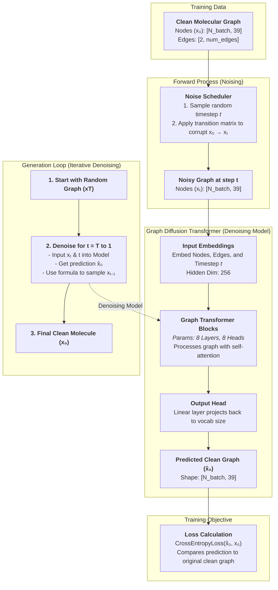
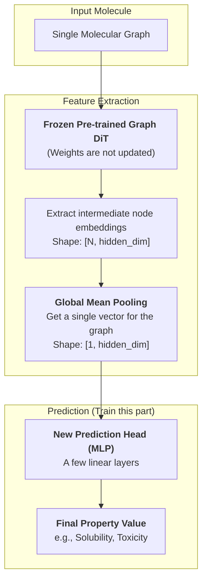
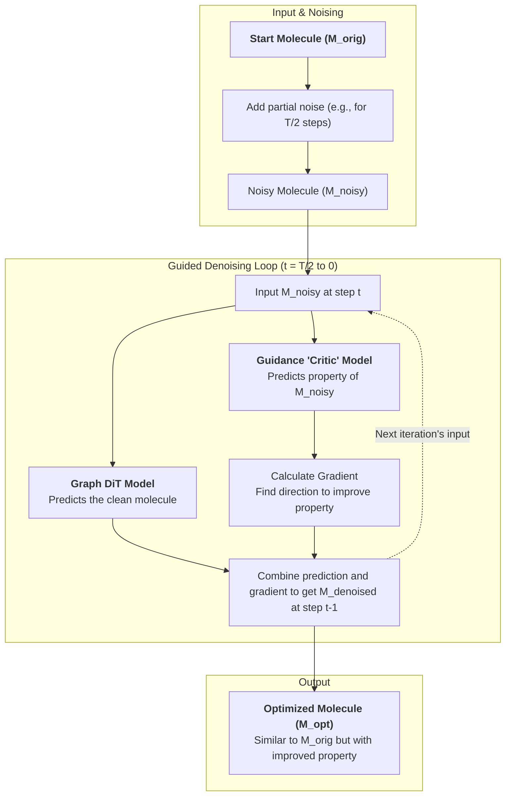
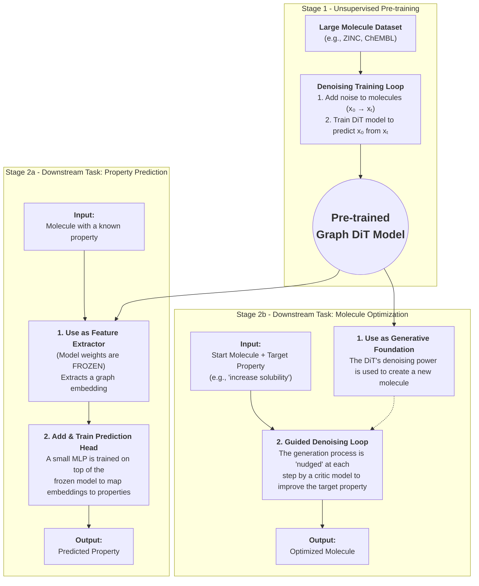

Here is a step-by-step guide on how to implement **Graph Diffusion Transformer (Graph DiT)** , broken down into conceptual and practical components.


### 1\. The Core Concept: Denoising on a Graph

At its heart, the process is simple:

1.  **Forward Process (Noising):** Take a clean, structured molecular graph. Systematically add "noise" to it over a series of timesteps, $t=1, ..., T$. For graphs, noise isn't just random numbers; it means corrupting atom types and bond types until the graph is essentially random.
2.  **Reverse Process (Denoising):** Train a powerful model—the Graph Diffusion Transformer—to reverse this process. The model's job is to look at a noisy graph at any timestep $t$ and predict the original, "clean" graph (or, more commonly, predict the noise that was added).
3.  **Generation:** To create a new molecule, start with a completely random graph and use the trained model to denoise it step-by-step, from $t=T$ all the way down to $t=0$.

### 2\. Step-by-Step Implementation

Let's break down the implementation into key modules. We'll assume you are using a framework like PyTorch along with PyTorch Geometric (PyG) for graph handling.

#### Step 1: Data Representation and Preprocessing

Your molecules need to be represented as graphs. Each graph $G = (V, E)$ consists of nodes (atoms) and edges (bonds).

  * **Node Features ($X$):** A matrix where each row is an atom. Features should be categorical, like atom type (e.g., C, N, O, F...). It's best to represent these as integers or one-hot vectors. Let's say you have $M$ possible atom types. Your node feature matrix will be of size `[num_atoms, M]`.
  * **Edge Features ($E$):** A matrix for the bonds. Features are bond types (e.g., single, double, triple, aromatic). Similar to nodes, represent these as integers or one-hot vectors.
  * **Adjacency Information:** PyG handles this with an `edge_index` tensor of shape `[2, num_edges]`.

#### Step 2: The Forward Process (Noising Scheduler)

This is a critical part that defines how you corrupt the graph. Since your features (atom/bond types) are categorical, you cannot simply add Gaussian noise. Instead, you use a **transition matrix**.

1.  **Define a Noise Schedule:** First, define a variance schedule $\\beta\_t$ that increases from $t=0$ to $t=T$. A common choice is a linear or cosine schedule.
    $$\beta_t \in (0, 1) \quad \text{for} \quad t=1, ..., T$$
2.  **Create a Transition Matrix:** For node features, you create a time-dependent transition matrix $Q\_t$. This matrix defines the probability of an atom of type `i` transitioning to type `j` at time $t$. A simple approach:
      * An atom type has a high probability of staying the same.
      * It has a small, uniform probability of transitioning to any other atom type.
      * This can be formulated as:
        $$q(x_t | x_{t-1}) = (1 - \beta_t) \cdot I + \frac{\beta_t}{M} \cdot \mathbf{1}\mathbf{1}^T$$
        where $I$ is the identity matrix and $M$ is the number of atom types. You can pre-calculate the full transition matrix $q(x\_t | x\_0)$ to jump to any timestep $t$ directly.
3.  **Apply Noise:** In your data loader, for each graph:
      * Sample a random timestep $t \\sim U(1, T)$.
      * Use the pre-calculated transition probabilities $q(x\_t | x\_0)$ to corrupt the original node and bond features ($X\_0$, $E\_0$) to get the noised versions ($X\_t$, $E\_t$).

#### Step 3: The Graph Diffusion Transformer Architecture

This is the denoising model. It takes the noised graph, the timestep $t$, and any optional conditions (like desired chemical properties) as input.

```python
import torch
import torch.nn as nn
from torch_geometric.nn import GATv2Conv # Or any other graph attention layer

class GraphDiffusionTransformer(nn.Module):
    def __init__(self, node_dim, edge_dim, hidden_dim, num_layers, num_heads):
        super().__init__()

        # 1. Input Embeddings
        self.node_embed = nn.Linear(node_dim, hidden_dim)
        self.edge_embed = nn.Linear(edge_dim, hidden_dim)

        # 2. Timestep Embedding
        self.time_embed = nn.Sequential(
            nn.Linear(hidden_dim, hidden_dim),
            nn.SiLU(),
            nn.Linear(hidden_dim, hidden_dim)
        )
        # We will use sinusoidal embeddings for the input to self.time_embed

        # 3. Transformer Blocks
        self.transformer_layers = nn.ModuleList([
            GraphTransformerBlock(hidden_dim, num_heads) for _ in range(num_layers)
        ])

        # 4. Output Head
        self.output_head = nn.Sequential(
            nn.LayerNorm(hidden_dim),
            nn.Linear(hidden_dim, node_dim) # Predicts probabilities for each atom type
        )

    def forward(self, x, edge_index, edge_attr, t):
        # x: [num_nodes, node_dim], edge_attr: [num_edges, edge_dim]
        # t: [batch_size]

        # Embed inputs
        x_emb = self.node_embed(x)
        edge_emb = self.edge_embed(edge_attr)

        # Create and embed timestep
        t_sinusoidal = self.sinusoidal_embedding(t, self.hidden_dim)
        t_emb = self.time_embed(t_sinusoidal) # Shape: [batch_size, hidden_dim]

        # Add timestep embedding to each node
        # Need to align batch indices for nodes and t_emb
        x_emb = x_emb + t_emb[batch_idx_for_nodes]

        # Pass through transformer blocks
        for layer in self.transformer_layers:
            x_emb = layer(x_emb, edge_index, edge_emb)

        # Predict the noise (or original features)
        pred_noise = self.output_head(x_emb)
        return pred_noise

# Helper: GraphTransformerBlock using a Graph Attention Layer
class GraphTransformerBlock(nn.Module):
    def __init__(self, hidden_dim, num_heads):
        super().__init__()
        self.attn = GATv2Conv(hidden_dim, hidden_dim, heads=num_heads, edge_dim=hidden_dim)
        self.norm1 = nn.LayerNorm(hidden_dim * num_heads)
        self.ffn = nn.Sequential(
            nn.Linear(hidden_dim * num_heads, hidden_dim * 4),
            nn.GELU(),
            nn.Linear(hidden_dim * 4, hidden_dim * num_heads)
        )
        self.norm2 = nn.LayerNorm(hidden_dim * num_heads)

    def forward(self, x, edge_index, edge_attr):
        attn_out = self.attn(x, edge_index, edge_attr=edge_attr)
        x = self.norm1(attn_out + x) # Residual connection
        ffn_out = self.ffn(x)
        x = self.norm2(ffn_out + x) # Residual connection
        return x
```

#### Step 4: The Training Loop

The training process ties everything together.

```python
# --- PSEUDOCODE FOR TRAINING ---

model = GraphDiffusionTransformer(...)
optimizer = torch.optim.Adam(model.parameters(), lr=1e-4)

for batch in dataloader:
    # batch is a PyG Batch object containing clean graphs (x_0, edge_index_0, etc.)
    optimizer.zero_grad()

    # 1. Sample a random timestep t for each graph in the batch
    t = torch.randint(0, T, (batch.num_graphs,), device=device)

    # 2. Create the noised graph x_t using your forward process scheduler
    # This involves applying the transition matrix to the clean features
    x_t, added_noise = forward_process(batch.x, t) # added_noise is x_0 - x_t or similar

    # 3. Get the model's prediction
    # The model should predict the original clean graph x_0 or the noise
    predicted_x_0 = model(x_t, batch.edge_index, batch.edge_attr, t)

    # 4. Calculate the loss
    # Since features are categorical, CrossEntropyLoss is a great choice.
    # The target is the original, clean atom types (batch.x).
    loss = F.cross_entropy(predicted_x_0, batch.x.argmax(dim=-1))

    # 5. Backpropagate and update
    loss.backward()
    optimizer.step()
```

#### Step 5: Generation (Inference)

This is the reverse process, executed as a loop from $t=T$ down to $0$.

1.  **Start with Noise:** Create a random graph $G\_T$. This can be a graph with a certain number of nodes where atom and bond types are drawn from a uniform distribution.
2.  **Iterative Denoising:** Loop from $t = T, T-1, ..., 1$:
      * Feed the current graph $G\_t$ into the model to get a prediction of the clean graph, $\\hat{G\_0} = \\text{model}(G\_t, t)$.
      * Use the predicted $\\hat{G\_0}$ and the current noisy $G\_t$ to calculate the likely graph at the previous timestep, $G\_{t-1}$. This step uses a specific sampling formula derived from Bayes' theorem that combines the model's prediction with some controlled noise injection.
3.  **Final Output:** The graph at the end of the loop, $G\_0$, is your newly generated molecule.

### Practical Libraries and Resources

  * **PyTorch Geometric (PyG) & DGL:** Absolutely essential for handling graph data and implementing graph neural networks in Python.
  * **Hugging Face Diffusers:** While primarily for image/audio, their `Scheduler` implementations and diffusion model pipelines are the gold standard. You can learn the logic and structure from their code, even if you can't use it directly for graphs.
  * **Graph DiT Official Repository:** Check out the official implementation for the paper "**A General-Purpose Recipe for Diffusion-Based Graph Generation**". Exploring their code on GitHub will provide the most direct and accurate implementation details. You can find it by searching for the paper title.

### The Graph Diffusion Transformer Pretraining Architecture


### The Graph DiT Model Molecule Property Prediction Architecture



### The Graph DiT Model Molecule Optimization Architecture


### The Graph DiT Model Architecture all in one


