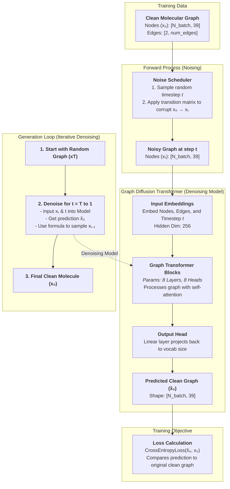
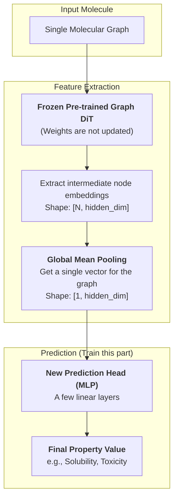
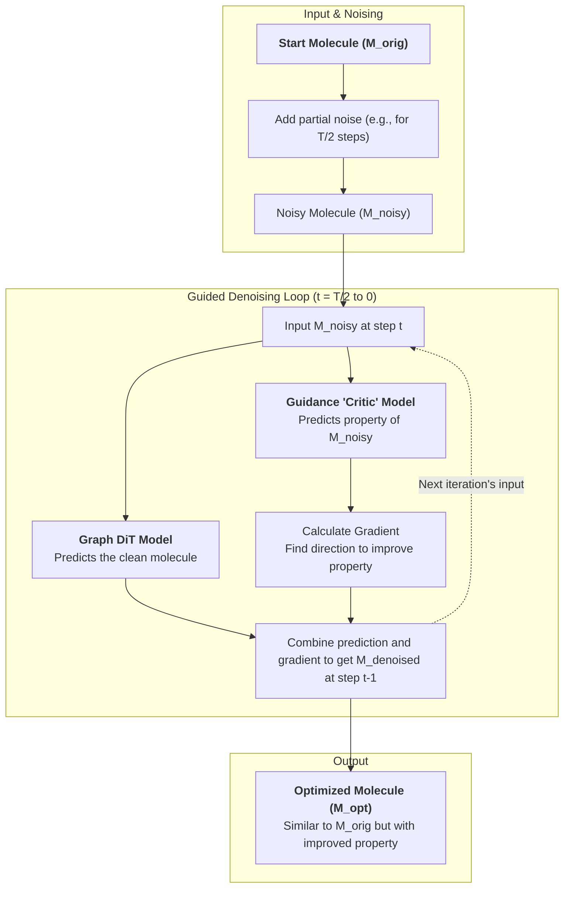
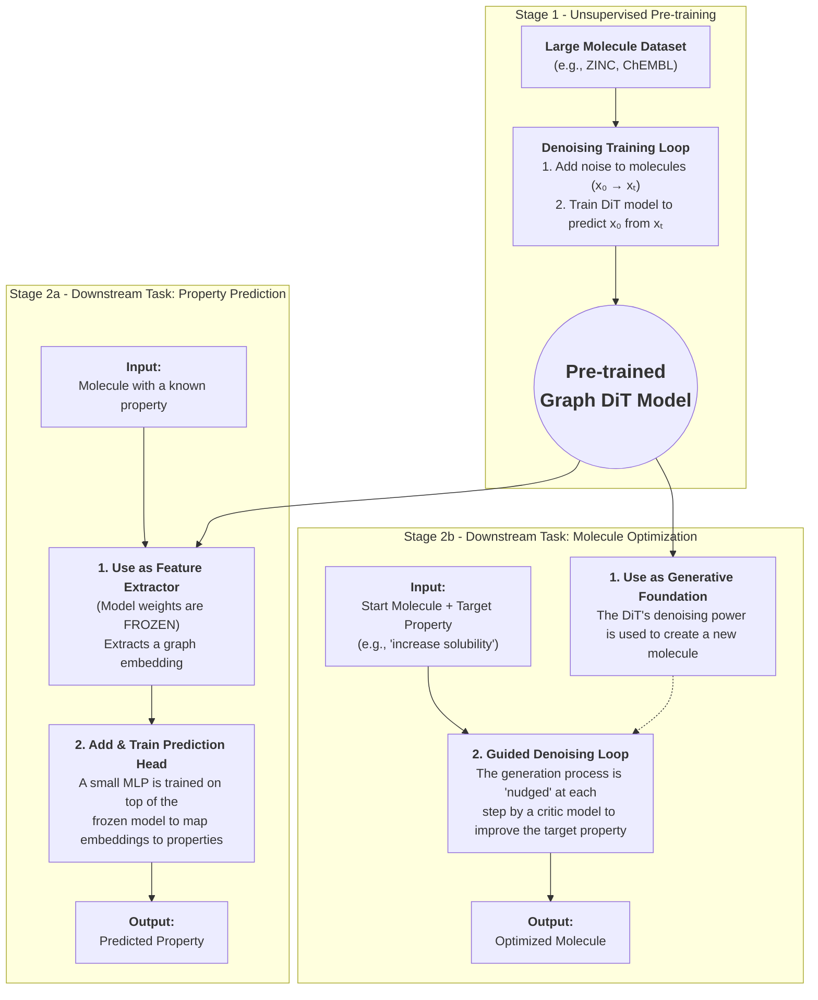

```mermaid
graph TD
    subgraph "Training Data"
        A["<b>Clean Molecular Graph</b><br>Nodes (x₀): [N_batch, 39]<br>Edges: [2, num_edges]"]
    end

    subgraph "Forward Process (Noising)"
        B["<b>Noise Scheduler</b><br>1. Sample random timestep <i>t</i><br>2. Apply transition matrix to corrupt x₀ → xₜ"]
        C["<b>Noisy Graph at step t</b><br>Nodes (xₜ): [N_batch, 39]"]
        A --> B --> C
    end

    subgraph "Graph Diffusion Transformer (Denoising Model)"
        D["<b>Input Embeddings</b><br>Embed Nodes, Edges, and Timestep <i>t</i><br>Hidden Dim: 256"]
        E["<b>Graph Transformer Blocks</b><br><i>Params: 8 Layers, 8 Heads</i><br>Processes graph with self-attention"]
        F["<b>Output Head</b><br>Linear layer projects back to vocab size"]
        G["<b>Predicted Clean Graph (x̂₀)</b><br>Shape: [N_batch, 39]"]
        D --> E --> F --> G
    end

    subgraph "Training Objective"
        H["<b>Loss Calculation</b><br>CrossEntropyLoss(x̂₀, x₀)<br>Compares prediction to original clean graph"]
    end

    subgraph "Generation Loop (Iterative Denoising)"
        I["<b>1. Start with Random Graph (xT)</b>"]
        J["<b>2. Denoise for t = T to 1</b><br>   - Input xₜ & t into Model<br>   - Get prediction x̂₀<br>   - Use formula to sample xₜ₋₁"]
        K["<b>3. Final Clean Molecule (x₀)</b>"]
        I --> J --> K
        J -.->|"Denoising Model"| E
    end

    C --> D
    G --> H
```

```mermaid
graph TD
    subgraph "Input Molecule"
        A["Single Molecular Graph"]
    end

    subgraph "Feature Extraction"
        B["<b>Frozen Pre-trained Graph DiT</b><br>(Weights are not updated)"]
        C["Extract intermediate node embeddings<br>Shape: [N, hidden_dim]"]
        D["<b>Global Mean Pooling</b><br>Get a single vector for the graph<br>Shape: [1, hidden_dim]"]
        A --> B --> C --> D
    end

    subgraph "Prediction (Train this part)"
        E["<b>New Prediction Head (MLP)</b><br>A few linear layers"]
        F["<b>Final Property Value</b><br>e.g., Solubility, Toxicity"]
        D --> E --> F
    end
```

```mermaid
graph TD
    subgraph "Input & Noising"
        A["<b>Start Molecule (M_orig)</b>"]
        B["Add partial noise (e.g., for T/2 steps)"]
        C["Noisy Molecule (M_noisy)"]
        A --> B --> C
    end

    subgraph "Guided Denoising Loop (t = T/2 to 0)"
        D["Input M_noisy at step t"]
        E["<b>Graph DiT Model</b><br>Predicts the clean molecule"]
        F["<b>Guidance 'Critic' Model</b><br>Predicts property of M_noisy"]
        G["Calculate Gradient<br>Find direction to improve property"]
        H["Combine prediction and gradient to get M_denoised at step t-1"]

        D --> E
        D --> F
        F --> G
        E --> H
        G --> H
        H -.->|"Next iteration's input"| D
    end

    subgraph "Output"
        I["<b>Optimized Molecule (M_opt)</b><br>Similar to M_orig but with improved property"]
    end

    C --> D
    H --> I
```

```mermaid
graph TD
    %% Stage 1: Pre-training the model
    subgraph "Stage 1 - Unsupervised Pre-training"
        A["<b>Large Molecule Dataset</b><br>(e.g., ZINC, ChEMBL)"] --> B["<b>Denoising Training Loop</b><br>1. Add noise to molecules (x₀ → xₜ)<br>2. Train DiT model to predict x₀ from xₜ"]
        B --> M(("<font size=5><b>Pre-trained<br>Graph DiT Model</b></font>"))
    end

    %% Central Model Artifact - The output of Stage 1 and input for Stage 2

    %% Stage 2a: Property Prediction
    subgraph "Stage 2a - Downstream Task: Property Prediction"
        P_in["<b>Input:</b><br>Molecule with a known property"]
        M --> P1["<b>1. Use as Feature Extractor</b><br>(Model weights are FROZEN)<br>Extracts a graph embedding"]
        P_in --> P1
        P1 --> P2["<b>2. Add & Train Prediction Head</b><br>A small MLP is trained on top of the<br>frozen model to map embeddings to properties"]
        P2 --> P_out["<b>Output:</b><br>Predicted Property"]
    end

    %% Stage 2b: Molecule Optimization
    subgraph "Stage 2b - Downstream Task: Molecule Optimization"
        O_in["<b>Input:</b><br>Start Molecule + Target Property<br>(e.g., 'increase solubility')"]
        M --> O1["<b>1. Use as Generative Foundation</b><br>The DiT's denoising power is used to create a new molecule"]
        O1 -.-> O2
        O_in --> O2["<b>2. Guided Denoising Loop</b><br>The generation process is 'nudged' at each<br>step by a critic model to improve the target property"]
        O2 --> O_out["<b>Output:</b><br>Optimized Molecule"]
    end
```